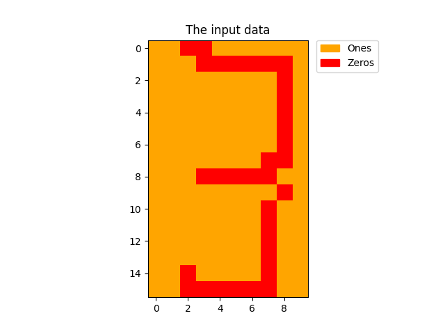

# Hopfield Networks!

We store patterns of five digits; 0 to 4, in a Hopfield Network using Hebb's rule.

The package enables us to easily draw images that the Hopfield model will try to recognise!

For example, this image was drawn in the GUI.

And this is what the network recognised!

